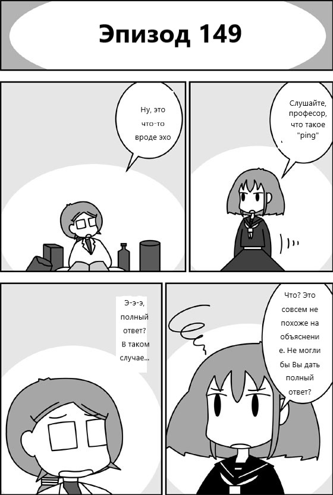
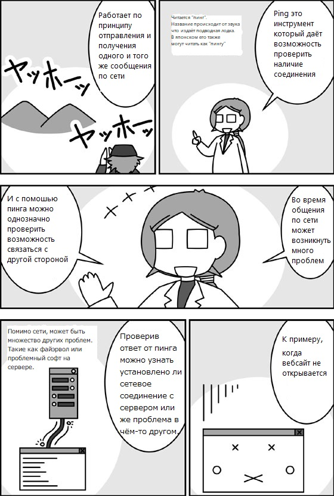
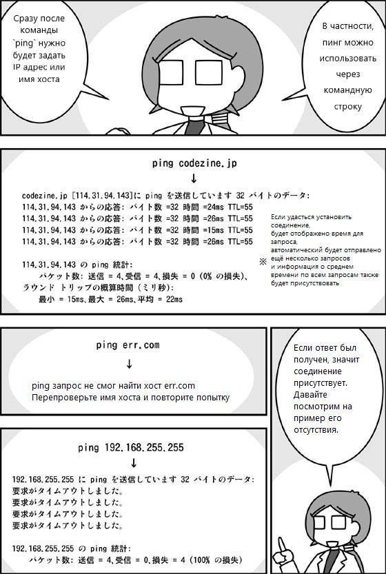
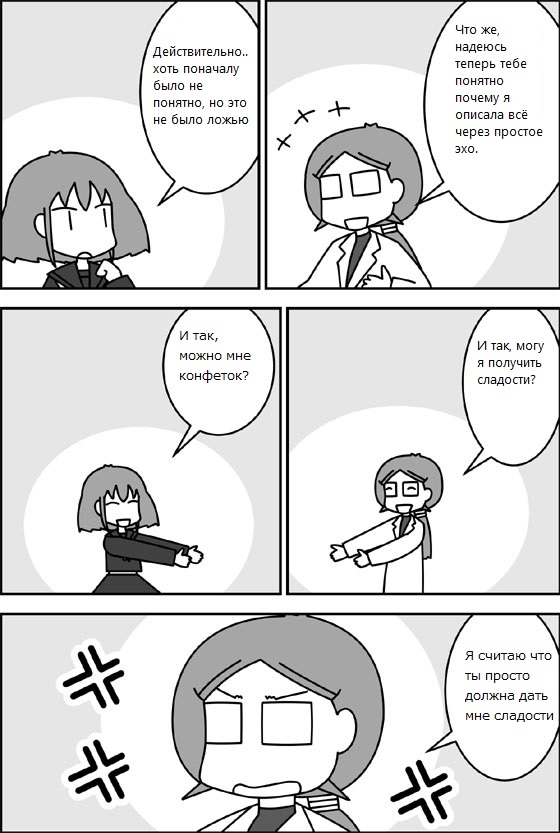

 
 

## Пояснение
"Пинг" - это тулза для проверки возможна ли коммуникация с конкретным хостом в сети.
Вне зависимости используете вы Windows, Mac или Linux, везде использование через командную строку будет одинаковым.
Сразу после комады "ping" в терминале нужно указать IP адресс или имя хоста(вроде www.microsoft.com) и этого достаточно для того чтобы проверить возможность общения с другой стороной.

Пинг был так назван за свою схожесть с работой сонара на подводной лодке.(мой коммент. Я хз, мне казалось что всё идет от ping-pong)

На практике, пинг отправляет несколько запросов и измеряет время отклика. Слишком долгий отклик может означать наличие неполадок в сети.
Если ответа и вовсе нет, то прежде всего это означает что никто запрос не получил, что может быть вызвано отсутствием сети, блокировкой фаэрвола, и т.д.
Хоть причина ошибки и не известна, за то точно известно что общение не возможно.

Пинг является основным инструментом для проверки состояния сети. Кроме самого хоста можно также увеличить количество попыток или изменить время ожиданя ответа.

## Пример
Попробуйте выполнить следующую команду в командной строке:

```ping codezine.jp```

Вывод:
```
codezine.jp [114.31.94.143]に ping を送信しています 32 バイトのデータ:
114.31.94.143 からの応答: バイト数 =32 時間 =10ms TTL=55
114.31.94.143 からの応答: バイト数 =32 時間 =10ms TTL=55
114.31.94.143 からの応答: バイト数 =32 時間 =17ms TTL=55
114.31.94.143 からの応答: バイト数 =32 時間 =15ms TTL=55
114.31.94.143 の ping 統計:
    パケット数: 送信 = 4、受信 = 4、損失 = 0 (0% の損失)、
ラウンド トリップの概算時間 (ミリ秒):
    最小 = 10ms、最大 = 17ms、平均 = 13ms
```
 ## Оригинал
 https://codezine.jp/article/detail/11409
 
 ## Новые слова
 表示（hyouji）- display
 たとえば、ウェブサイトが表示されないとする
 
 返信（henshin）- reply
 通信 (tsushin) - communication
 pingの返信があれば通信自体はできているそれ以外のところで原因があると分かる
 
 平均 (heikin) - average
 平均時間などが表示される
 
